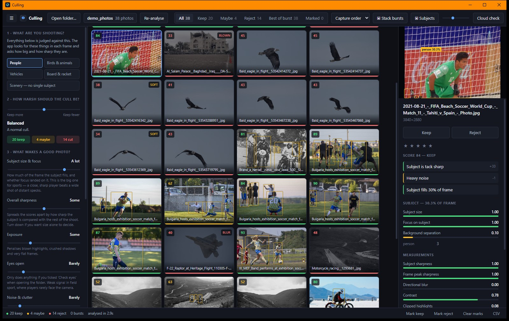
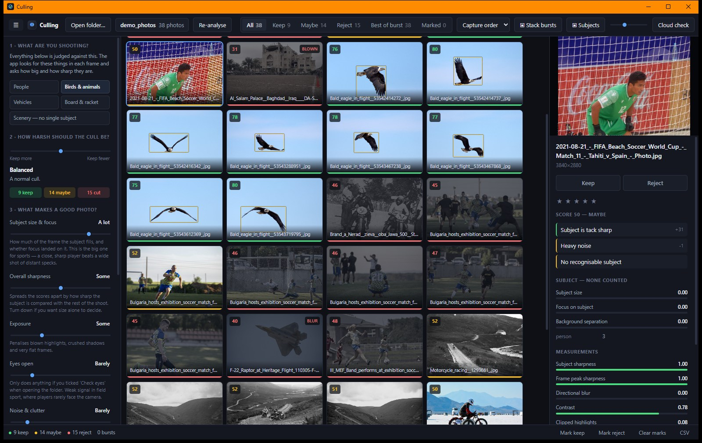
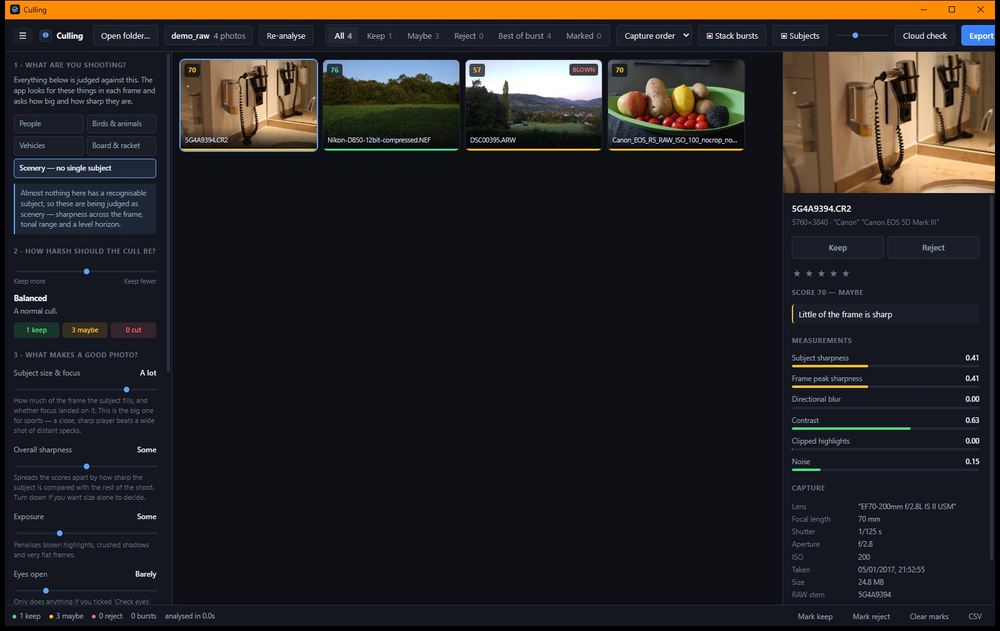
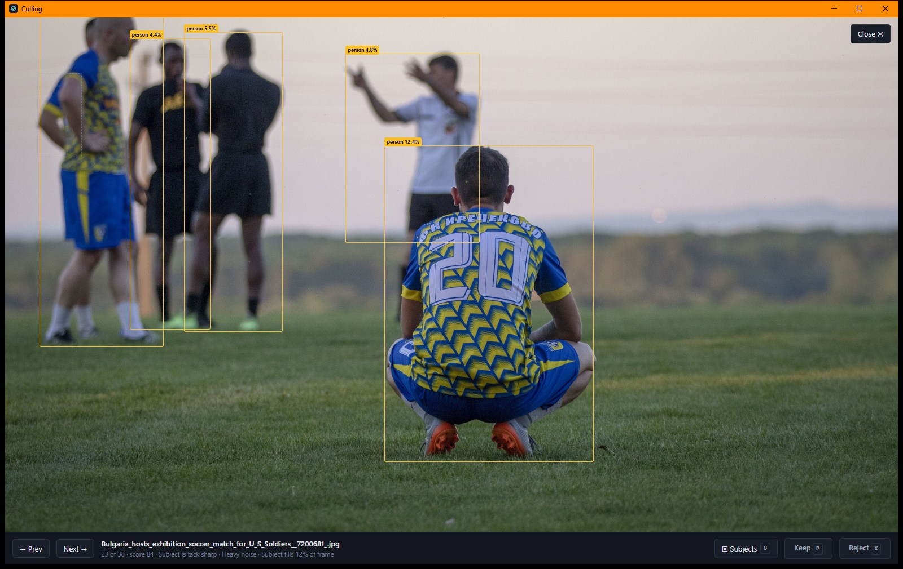

# Culling

Automatic photo culling for sports and event shooters. Point it at a folder of
JPEGs — or of RAW files — and it scores every frame on how large and how sharp
its subject is, groups burst sequences so you only judge the best of each, and
then resolves your picks back to the matching **RAW** files.

Built with Rust + Tauri (backend and all pixel work) and React (interface).
Runs on Windows and Linux.



Each frame is scored on how large and how sharp its **subject** is, not on how
sharp the picture is overall. Detected subjects are outlined; the panel on the
right says exactly why a frame got the score it did.

## Tell it what you are shooting

The same folder, re-scored with one click. Nothing is re-analysed — the
detections are already there, only the question changed.

| Looking for **people** | Looking for **birds & animals** |
| --- | --- |
|  |  |
| Soccer frames score 84 and keep. The eagles have no recognisable subject and sink to 33–45. | The eagles are found and score 75–80. The soccer frames drop to 45–52. |

Presets cover people, birds and animals, vehicles, and board sports — 80 COCO
classes underneath, so it works for whatever you shoot next.

## Landscapes, and RAW files



**Scenery.** A landscape has no subject to find, and scoring one as though it
should have had a subject was useless — an early version rejected 90% of a
landscape folder and bunched every score between 44 and 50. Frames with nothing
recognisable in them are now judged on sharpness across the frame, tonal range
and a level horizon instead. That decision is made per shoot rather than per
frame, and can be forced either way, because in a football set a frame where you
missed the players is a failure, not a landscape.

**RAW.** Point it at CR3, CR2, NEF, ARW, DNG, RAF, ORF, RW2 and the rest, and it
reads them directly. Not by demosaicing — by pulling out the JPEG preview the
camera already rendered, which is both what the back of the camera showed you
and what makes Photo Mechanic feel instant. On a Canon R5 that preview is the
full 8192×5464 frame, and extracting it takes about 15 ms.

Full EXIF comes through, including from CR3, whose ISO-BMFF container ordinary
EXIF parsers cannot read — the metadata is taken from inside the preview
instead.

## See what it saw



Press <kbd>B</kbd> in the loupe to outline every detection with its size. Here
the crouching player fills 12.4% of the frame and is the subject; the figures
on the touchline are 4–6% and are not.

> Screenshots use public-domain photographs from
> [Wikimedia Commons](https://commons.wikimedia.org). The author's own test
> images are not shown: they contain identifiable people who did not consent to
> appearing online.

---

## The workflow it is built around

You shoot RAW+JPEG. You cull the JPEG proxies, because they are small and fast,
and what you actually want out the other end is the list of **RAW files worth
editing**. So the JPEG is never the deliverable here — the export step matches
`026A2371.JPG` to `026A2371.CR3` by file stem and acts on the RAW.

Nothing is destructive by default. The most aggressive export option is a move,
and even that refuses to overwrite an existing file.

---

## What it measures

Everything below comes from a **single decode per photo** at 3072 px on the
long edge. Decoding is by far the most expensive step, so the working image is
computed once and reused for every measurement and for the thumbnail.

3072 px is deliberate, and was arrived at by measurement rather than taste: at
2048 px the focus differences on a 45 MP file have largely washed out, and a
face has to fill 3% of the frame before its eyes span enough pixels to judge —
most eye verdicts came back "unknown". 3072 is 3/8 of a Canon 8192 px frame, so
the decoder can still reach it with a clean DCT scale.

### The subject

This is the part that decides whether a frame is any good, and it took a
detour to find.

Measured on the 872-frame test shoot, the frames a photographer keeps have a
**large subject**; the ones they bin have distant specks. Frame-wide sharpness
is not a weak proxy for that — it is *anti*-correlated with it. A wide record
shot is full of in-focus grass, crowd and treeline, so it scores higher on any
whole-frame measure than a tight action frame whose background is thrown out.
The first version's top-rated photo of the entire shoot was a wide shot whose
biggest subject filled **0.4%** of the frame; the header duel it ranked in the
middle filled **15%**.

So a detector finds the subject, and the score is built from it:

- **Prominence** — the largest subject's area, on a log scale, since area spans
  three orders of magnitude across a shoot (0.15% to 25%+).
- **Focus** — the subject's sharpness against the frame's own peak. Both
  numbers come from the same photograph, so scene, lens and light cancel out.
- **Isolation** — subject against background. A sharp subject on a soft
  background is a long lens on a real subject; the look of a keeper.

Model is **YOLOX-S** from the OpenCV Zoo (Apache-2.0, 34 MB, 40.5 mAP), giving
80 COCO classes — so the same scoring works for people, birds, dogs, horses,
bikes, cars and boards. Pick what you're shooting in the sidebar.

It was chosen over the smaller NanoDet-Plus for two reasons: `tract` cannot
load the NanoDet export at all (`Resize` with `pytorch_half_pixel`), and on
this material YOLOX was markedly more confident (0.85–0.92 versus 0.4–0.8) and
found the ball, which NanoDet missed. It costs ~70 ms per frame, taking a full
run from 34 s to about 95 s.

**Two measurement biases had to be corrected**, both the same trap in different
clothes:

- *Large boxes read soft.* Most of a person's bounding box is smooth clothing,
  so a tack-sharp player filling a quarter of the frame measured *softer* than
  a distant one whose box was mostly grass. Subject sharpness is therefore
  tiled and taken at a high percentile — the question is whether crisp detail
  exists somewhere on the subject, not what the box averages.
- *The biggest subject isn't always the subject.* On a touchline the largest
  box is regularly a linesman two metres from the lens and far outside the
  plane of focus. The main subject is picked by size **and** focus together, so
  a blurred foreground bystander cannot hijack the frame. This works: the three
  frames where a linesman walked through the shot rank ~830/872, while a 20.7%
  subject that is actual action ranks 13th.

### Sharpness

"Is this photo sharp?" really means "is the *subject* sharp?", so sharpness is
measured on the detected subject and nothing else. The frame-wide figures below
are still computed, but they only decide the score when there is no subject to
measure:

- Variance of the Laplacian is computed **per tile** across a 16-wide grid.
- The **95th percentile** of that map is the frame's sharpness — it survives
  bokeh backgrounds, and serves as the reference the subject is compared against.
- Fallback order is subject → face → whole frame.

Two separate jobs come out of that number, and conflating them was the single
biggest source of wrong answers during development:

- **Labelling is absolute.** A frame is only ever called soft if it really is
  soft, against a scale calibrated on real material. An earlier version ranked
  each frame against the shoot's 10th–90th percentile, which stretched trivial
  differences across the whole range and cheerfully labelled perfectly focused
  photographs "badly out of focus".
- **Ranking is relative.** On a shoot where every frame is competently focused
  — the normal case with modern autofocus — absolute sharpness barely varies,
  and a score built on it alone collapses every photo into the top decile and
  sorts nothing. A percentile term restores the spread the grid needs.

Sharpness sets the baseline score and everything else **deducts** from it.
Averaging the four components instead, as the first version did, failed badly:
exposure and framing sit at 100 for most competent frames, so the average
dragged every photo into the top decile again.

### Motion blur

Directional smear is separated from defocus by measuring how concentrated the
gradient orientations are (circular variance over doubled angles). Crucially, a
motion penalty is only applied to frames that are **also soft** — a sharp photo
full of goalposts and pitch markings is anisotropic too, and must not be
punished for it. A fast shutter halves the penalty, since the smear is then
subject motion, which is often the point.

### Exposure

Luminance histogram → clipped highlights, crushed shadows, mean bias, and
global contrast. "Clipped" is deliberately loose (250+ / 5−) because JPEG
quantisation smears the true clipping point.

### Faces and eyes

- **Detection**: [YuNet](https://github.com/opencv/opencv_zoo) (227 KB,
  Apache-2.0), run through [`tract`](https://github.com/sonos/tract) — a pure
  Rust ONNX runtime, so there is no native DLL to download or ship.
- **Eye state**: an open eye contains a compact dark blob (iris and pupil)
  against bright sclera; a closed eye is a smooth lid whose dark region is wide
  and flat. The crop is split with Otsu's method and judged on the shape,
  contrast and fill of the dark region. It reports **`unknown` rather than
  guessing** when the face is too small or soft to call, and the interface
  always shows which source produced a verdict.

  That last part is doing real work. An early version treated "flat, low
  contrast crop" as evidence of a closed eye, and duly declared **two thirds of
  all faces** to be blinking. A flat crop means you cannot see the eye, which
  is a different answer from "the eye is shut". The thresholds are also
  deliberately asymmetric: calling a good frame a blink costs the user a keeper
  and their trust in the tool, whereas a missed blink merely survives to be
  looked at.

  Only the *shape* of the dark region carries the verdict. Dark/light
  separation, fill ratio and contrast are all just as high for a closed eye —
  a lash line is dark against skin, fills its bounding box, and has plenty of
  contrast. An earlier version added credit for all three, which put a hard
  floor of 0.58 under every score, sitting exactly on the "eyes open"
  threshold; the classifier could not report a blink at all and never fired
  once across 872 frames. `faces.rs` has unit tests pinning this: a synthetic
  open eye and a synthetic closed eye must stay more than 0.40 apart.

  **Known limits.** On the 872-frame test shoot it calls 5 faces closed. Spot
  checking those against the originals, they are mostly *eyes downcast or not
  visible* rather than strict blinks — a reasonable thing to cull on, but not
  the same claim. Faces below roughly 22 px of eye separation are reported
  `unknown` rather than guessed at, which on long-lens sports work is most of
  them. This is the measurement the optional cloud check exists to improve.

- **Face sharpness is judged against the frame's own peak**, not an absolute
  threshold. Skin is smooth — a perfectly focused face carries far less
  high-frequency detail than grass or a crowd, so an absolute test convicts
  every portrait in the shoot. Comparing the face to the sharpest content in
  the *same* photograph asks the question that actually matters: did focus land
  on the subject, or on the turf behind them? Scene, lens and light all cancel.

Eye state is the one measurement where a local heuristic is genuinely weaker
than a model, which is what the optional cloud check is for (below).

### Near-duplicates and bursts

Two hashes are computed because they fail differently — **dHash** (local
gradients, catches "same frame, tiny shift") and **pHash** (low-frequency DCT,
tolerates exposure changes) — plus a continuous 8×8 signature as a tiebreak.

By default a frame joins a burst only when it is close in **both time and
appearance**, but each signal has its own checkbox, because which you trust
depends on how you shoot. Grouping is union-find over a sliding window, so it
stays linear.

**How good is capture time on its own?** Better than expected, if the window is
tight. Measured over the 872-frame test shoot (`cargo run --release --example
gaps`), where every frame carried sub-second EXIF:

| Gap to previous frame | Pairs | ...that look *different* |
| --- | --- | --- |
| **0.06–0.12s** | **485** | **3%** |
| 0.12–0.25s | 6 | 17% |
| 0.25–0.5s | 64 | 42% |
| 0.5–1s | 99 | 63% |
| 1–2s | 89 | 82% |
| >2s | 128 | 92% |

Continuous drive fires every 0.06–0.12s and then there is a near-empty band
before 0.25s — a clean natural boundary between "same burst" and "shutter
pressed again". Grouping on time alone below 0.2s joins visibly different
pictures only 3% of the time.

It degrades fast, though: 16% wrong at 1s, 24% at 2s. The other failure mode is
worse than the percentage suggests — shooting steadily through a passage of play
leaves no gaps at all, and at a 2s window the longest unbroken run was **54
frames**, which would collapse an entire attacking move into one stack.

Hence the 0.5s default. Appearance has the opposite failure: it will happily
merge two wide shots of the same goalmouth taken minutes apart, which is why
time is still required by default.

Within a group the highest-scoring frame is the pick. Runners-up that are
within 3 points are called out as near-ties rather than quietly rejected —
you may legitimately prefer one, and a near-tie is a weak reason to cut.

In the grid, bursts **stack**: the group collapses to its winner, drawn with
offset layers behind it and a badge showing how many frames it holds. Click the
badge to expand the stack in place — the other frames appear immediately after
their head, in rank order, marked as duplicates. "Stack bursts" in the toolbar
turns the behaviour off entirely. On the test shoot this takes 872 cards down
to 354 (299 stacks plus 55 singles).

### Scoring

Every deduction is recorded as a reason with its point value. The score is not
a black box: if the app rejects a frame, the panel says exactly why and by how
much, and you can disagree with one keypress.

Re-scoring is free — no pixels are re-read — so every slider in the sidebar
updates the whole set instantly.

---

## The optional cloud check

Uploading 872 frames at 13 MB each would take hours and buy nothing. Sharpness,
exposure and duplicate detection are all better done locally.

So the cloud pass is deliberately narrow: it sends **face crops of ~192 px**,
only for frames whose eye state the local heuristic could not confidently
judge, and only when you switch it on. A typical shoot sends a few dozen
requests of a few kilobytes — comfortably inside a free tier.

- **Google Gemini** — has a free tier; key from
  [aistudio.google.com/apikey](https://aistudio.google.com/apikey).
- **Anthropic Claude** — paid; key from
  [console.anthropic.com](https://console.anthropic.com).

The key is held in memory for the session only. It is never written to disk and
never handed back to the interface. There is a hard request ceiling so a
misconfiguration cannot run away with your quota.

---

## Running it

```bash
npm install
npm run app          # dev, with hot reload
npm run app:build    # produce an installer
```

Requires Node 18+ and a Rust toolchain. On Windows you also need the MSVC build
tools; on Linux, the usual `webkit2gtk` / `libayatana-appindicator` packages
Tauri asks for.

### Headless smoke test

Runs the real pipeline over a folder and prints the score distribution, the
raw Laplacian percentiles, the eye-state breakdown, groupings and the
best/worst frames. This is how the constants above were calibrated, and it is
the fastest way to check the scoring against actual photographs without
launching the interface.

```bash
cd src-tauri
cargo run --release --example cull -- ../test_photos 60   # or omit 60 for all
```

Measured on an 872-frame Canon R5 shoot (8192×5464, 10.4 GB) on an 8-core
laptop:

```
872 photos in 31.8s  (36 ms each)

  keep    215  (25%)
  maybe   397  (46%)
  reject  260  (30%)

  burst groups  246  covering 837 of 872 frames
  score histogram spans 10-99, roughly bell shaped
```

If you change `WORK_SIZE`, re-run this: the Laplacian scale is
resolution-dependent, and the constants in `metrics.rs` assume 3072 px.

---

## Keyboard

| Key | Action |
| --- | --- |
| `← → ↑ ↓` | Move between photos |
| `Space` | Open the loupe |
| `C` | Compare the burst side by side (in the loupe) |
| `P` | Mark keep |
| `X` | Mark reject |
| `U` | Clear the mark |
| `0`–`5` | Star rating (written into XMP sidecars) |
| `Esc` | Close the loupe |

Manual marks always override the computed verdict, including inside a burst
group.

---

## Export

| Option | What it does |
| --- | --- |
| Copy | Copies matched RAWs to a folder. Never overwrites. |
| Move | Relocates them. Refuses to overwrite. |
| XMP sidecars | Writes `xmp:Rating` and a Keep/Reject `xmp:Label` next to the originals, for Lightroom / Capture One / Bridge. Will not clobber a sidecar this app did not write. |
| List | Writes full paths to a text file. Changes nothing on disk. |

There is also a CSV export of the full analysis, for working in a spreadsheet.

The export dialog previews the proxy→RAW match before writing anything, and
tells you which frames had no matching RAW.

Recognised RAW extensions: CR2, CR3, CRW, NEF, NRW, ARW, SRF, SR2, RAF, ORF,
RW2, PEF, PTX, DNG, 3FR, IIQ, GPR, RWL.

---

## Caching

Analysis results and thumbnails are cached under your OS cache directory, keyed
by path + mtime + size. Reopening a folder is instant; an edited or replaced
file is re-analysed automatically. The cache version is bumped whenever the
meaning of a metric changes, so stale results are discarded rather than mixed
in.

---

## Layout

```
src-tauri/src/
  decode.rs     scaled JPEG decode, orientation, resize, crop
  metrics.rs    sharpness map, exposure, motion blur, noise
  hash.rs       pHash / dHash / signature
  raw.rs        embedded JPEG preview extraction from RAW containers
  faces.rs      YuNet detection + eye-state estimation
  subjects.rs   YOLOX subject detection, prominence and isolation
  group.rs      burst and near-duplicate grouping
  score.rs      weighting, verdicts, reasons, group policy
  pipeline.rs   parallel orchestration, progress, thumbnails
  export.rs     proxy→RAW resolution, copy/move/XMP/CSV
  cloud.rs      optional face-crop verification
  cache.rs      on-disk result and thumbnail cache
src/
  App.tsx       layout, filters, selection, keyboard
  components/   grid, detail panel, loupe, export, cloud, sidebar
```

## Licence

**GPL-3.0-or-later.** See [LICENSE](LICENSE).

In short: use it, change it, share it. If you distribute a modified version,
you have to publish your source under the same terms — improvements come back.

The bundled models keep their own licences, both of which permit
redistribution and are compatible with GPL-3.0:

| Model | Purpose | Licence |
| --- | --- | --- |
| [YOLOX-S](https://github.com/Megvii-BaseDetection/YOLOX) | Subject detection | Apache-2.0, © Megvii Inc. |
| [YuNet](https://github.com/ShiqiYu/libfacedetection) | Face detection (optional) | MIT, © Shiqi Yu |

Both come via the [OpenCV Zoo](https://github.com/opencv/opencv_zoo). Full
notices are in [THIRD-PARTY-NOTICES.md](THIRD-PARTY-NOTICES.md).

> Note that Apache-2.0 is compatible with GPL-**3**.0 but *not* GPL-2.0, so
> this project cannot be relicensed to GPL-2.0 while it bundles YOLOX.

All 578 Rust dependencies are permissive (MIT / Apache-2.0 / BSD / Zlib). Five
are MPL-2.0, which is file-level copyleft and only binds you if you modify
those files.

## Building and releasing

```bash
npm install
npm run fetch-models   # models are not in the repo; YOLOX alone is 34 MB
npm run app            # dev
npm run app:build      # installer
```

Tagging a release builds installers for Windows, macOS (both architectures)
and Linux via [`.github/workflows/release.yml`](.github/workflows/release.yml),
and attaches them to a draft GitHub release:

```bash
npm version minor && git push --follow-tags
```

Models are bundled into the installer, so users download one file (~38 MB on
Windows) and it works offline.

**Before your first release**, set `REPO` in
[`src-tauri/src/update.rs`](src-tauri/src/update.rs) to your own
`owner/repo` — the built-in update check reads the GitHub releases API and will
404 against the placeholder.

macOS builds are unsigned, so users must right-click → Open the first time.
Signing needs a paid Apple Developer account.
